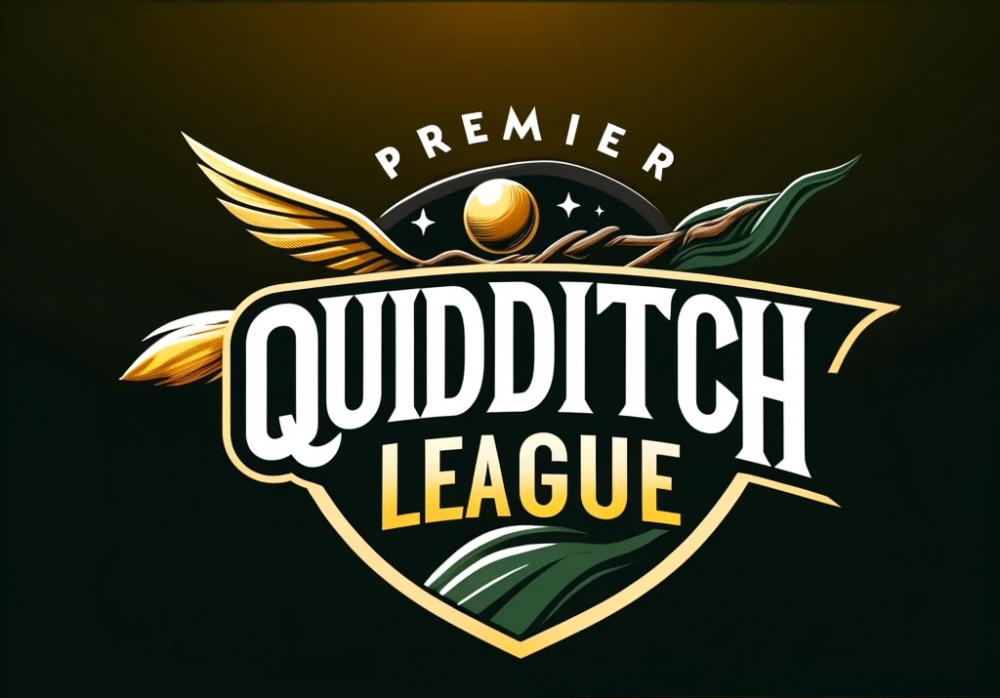

## Project

### Build the Lineup for the Premier Quidditch League (PQL)

**Hey Wizard!** 🧙‍♂️

Grab your wand and broomstick because it's time to set the stage for the Premier Quidditch League (PQL)! We're looking for a masterful potion of code to help our league managers create the newest Quidditch teams and assign those undrafted wizards and witches to fly high in the PQL.

#### Your Enchanted Mission:

Your challenge is to create a bewitching interface where our magisters (league managers) can not only form new teams like "Gryffindor" or "Slytherin" but also manage which wizards and witches are up in the air and which are still waiting for their chance to soar. 🧹

1. **Magical Team Formation Interface:**
    - **Team Incantation (Creation) Form:** Cast a spell with a form to create a team by naming it.
      - Name
        - Required.
        - Unique.
      - Description
        - Optional
    - **Scroll of Available Players:** Simultaneously, reveal a parchment (table) listing of all players not yet committed to a broomstick (not assigned to a team yet). This scroll should detail their name, age, and desired position in the skies (Seeker, Beater, Keeper, or Chaser).
    - Once invoked (submitted), this team should appear in a mystical dropdown. 📜
2. **Player Management Spellwork (Tasks):**
    - **Selective Player Removal:** Beside each player’s name in the table, place a “Remove” button. Clicking this button does not assign the player to the newly created team but merely removes them from the list of players for this specific team creation session. This action should not affect their availability for future team creations; they remain in the pool of unassigned players for other teams.
    - **Player Special Abilities:** Enhance the player management by allowing selection of special abilities that are dependent on the player's position. This should be dynamically populated (automatically filled) based on the position selected, with abilities like "Enhanced Vision" for Seekers or "Power Swing" for Beaters. 🧙‍♀️
3. **Enchanting Interface Design:**
    - **Visual Spellwork:** Employ CSS or a framework like Bootstrap to ensure the interface is not only functional but also visually appealing, befitting the grandeur of Quidditch. ✨
4. **Backend Broomsticks and Frontend Firebolts:**
    - **Summoning Player Data:** Use Axios or Fetch API to fetch the list of unassigned players from the `/api/players/unassigned` endpoint.
    - **Team Creation:** Post new team data to the `/api/teams` endpoint when a team is created.
5. **Testing the Enchantments:**
    - **Defensive Spells Against Bugs (Mistakes):** Utilize Jest and React Testing Library to test the functionality and interactivity of the form, ensuring robustness and reliability. 🛡️ Preferably use TDD for your development process.

**IMPORTANT!!!!**

We know this interface isn't the best for UX/UI purposes, feel free to modify it and make it yours aslong as you keep the main objective in mind that is to create teams and assign unassigned players to them.

#### Required Wizarding Tools:

- **Frontend Wandwork:** `React` & `Typescript` 🪄
- **Spellcasting for Data:** `Axios` or `Fetch API` for fetching and updating data 📡
- **Magical State Management:** React's Context API or useState/useReducer for managing state 🌟
- **Potion Testing:** `Jest` and `React Testing Library` for ensuring all magical components work as expected 🧪

#### Optional Wizarding Enhancements:
- Consider using `@tanstack/react-table` for an enhanced player listing experience, allowing features such as sorting and filtering.
- Implement `react-hook-form` alongside `yup` or `zod` for streamlined form management and robust data validation.

#### Backend Broomsticks and Frontend Firebolts:

To connect your frontend to the backend API, follow these instructions:

1. **API Documentation and Endpoints:**
    - All the instructions for the API and its documentation are located inside the `Api` folder in this repository.
    - This folder contains detailed information on how to interact with the endpoints, including how to fetch the list of unassigned players and how to post new team data.

2. **Summoning Player Data:**
    - Use the endpoints specified in the `Api` folder to fetch the list of unassigned players.
    - Example endpoint: `/api/players/unassigned`.

3. **Team Creation:**
    - Follow the instructions in the `Api` folder to post new team data.
    - Example endpoint: `/api/teams`.

Ensure your development server is running and accessible at the appropriate base URL (e.g., `http://localhost:3000`). For more detailed instructions and examples, please refer to the `Api` folder.

Happy coding, and may your API connections be as seamless as a well-cast spell! 🪄

### 📰 EXTRA EXTRA!!!

#### Wizarding Challenges for Seasoned Developers (Optional):

✨ If you believe you're the chosen one and the previous mission is merely a warm-up for your extraordinary talents, then by all means, conjure up some magic by tackling one (or more) of the following advanced challenges to enhance your solution.

These tasks are not required, but they will certainly leave us spellbound if you can master them. ✨

1. **Performance Enhancements:**
    - Optimize performance by implementing code-splitting and lazy loading of components using React's `React.lazy` and `Suspense`. ⚡
    
2. **Advanced State Management:**
    - Use a more advanced state management library such as Redux or Zustand to handle complex state logic and ensure a scalable solution as the application grows. 📈

3. **Internationalization Spell:**
    - Add internationalization support using libraries like `react-i18next` to make the application accessible to magisters from different regions. 🌍

4. **Responsive Design:**
    - Ensure the interface is fully responsive and works seamlessly on a variety of devices, from desktops to tablets to mobile phones. 📱

5. **Drag-and-Drop Enchantment:**
    - Implement a drag-and-drop interface using a library like `react-beautiful-dnd` or `react-dnd` to allow magisters to easily assign players to teams. This should support both adding and removing players from teams. 🧲

6. **Innovate:**
    - Introduce a unique feature that showcases a skill only you possess. 🌟

Prepare your wands and let your creativity soar! We can't wait to see the magical solutions you'll conjure. Take on this challenge, infuse it with your unique talents, and leave us all spellbound with your ingenuity. Good luck, and may your code be as flawless as a perfectly cast spell! 🪄
